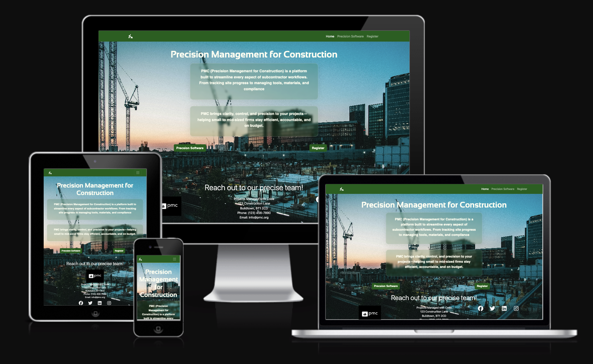
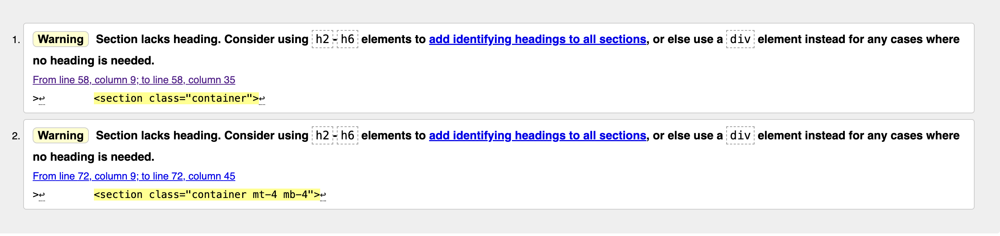
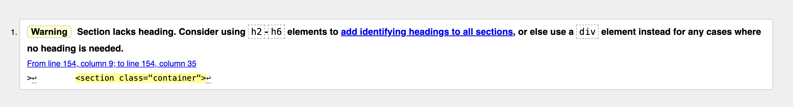

# Precision Management for construction
---
[Visit website here](https://sshang93.github.io/PMC-UI/)

This is the main website for PMC (Precision Management for Construction), a SaaS management platform. This website is to attract potential clients who own small to medium size construction companies, who are looking for a cheaper alternative to a management software to help run their business. The website is desinged to be responsive and accesible to a range of devices that can connect to the internet. 

---

## User Experience
---

### User Stories

1. First time visitor goals

- As a first time user i want to be able to know what product the website offers
- As a first time user i want the website to be easy to navigate
- As a first time user i want to be able to get leave my details so enquire about the product further 

2. Returning visitor goals

- As a returning visitor i want to leave my details for further enquiry
- As a returning visitor i want to be able to click on social media links

3. Frequent user goals

- As a frequent user i want make sure the product details are updated when SaaS has been purchased

### Design

##### Colour Scheme 
- The two main colours of the website are a dark green, and white. The white to contrast against the background picture and dark green. There is also a transparent, glass effect on div elements through out the design of the website. The effect have a shade of dark green so the design is consistent throughout the website. 
##### Typogoraphy
- The 'sansation' font (primary font) is used only for the heading on website pages, and 'atkinson-hyperlegible-mono'(secondary font) is used for the main content in the div elements. It keeps the site looking proffesional and making the desing of the website consistent
##### Imagery
- The background image makes sure the user knows the webiste is construction related, also it helps with the design and the constrasting colours used. 

##### Wireframes

### Features
---

- The website is responsive on all devices
- There elements within the website that will need the user to interact with 

### Technologies used
---

##### Languages 
- HTML5
-CSS3

##### Frameworks, Libraries & Programs used
<dl>
<dt>Bootstrap 5.3.3</dt>
<dd>Used to make sure that the website is responsive on all devices and used for the styling.<dd>

<dt>Hover:css<dt>
<dd>Used to make the call to action buttons on the pages on the website transparent when the cursor is over it making it unambiguos to users on where to go next after the landing page<dd>

<dt>Google fonts</dt>
<dd>Used to import 'Sansation' for the heading on each page and 'atkinson-hyperlegible-mono' for the main font for content in the div elements</dd>

<dt>Font awesome</dt>
<dd>Used for the social media links in the footer, and is a link to the homepage in the nav bar to the left. Icons used to enhace the UX aimimg to make the website aesthetically pleasing</dd>

<dt>Git</dt>
<dd>Version control was managed using Git through the Gitpod terminal, with changes committed locally and pushed to GitHub.</dd>

<dt>Github</dt>
<dd>Used to store the code for the project after it was pushed using Git</dd>

<dt>Balsamic</dt>
<dd>Used to create the wireframe during the design stage of the website</dd>
</dl>

### Testing
---

W3C markup validator and W3C CSS validator were used to make sure that there are no errors with the syntax on the project 

[WS3 HTML Validator](https://validator.w3.org/nu/#textarea) 
- Results for the index page, the warnings are for the lack of heading tags in the section, this is by design choice to not have a heading within the warning highlighted. 

- Results for the software.html page, warning is for the lack of h2 heading within a section, this is a design choice

